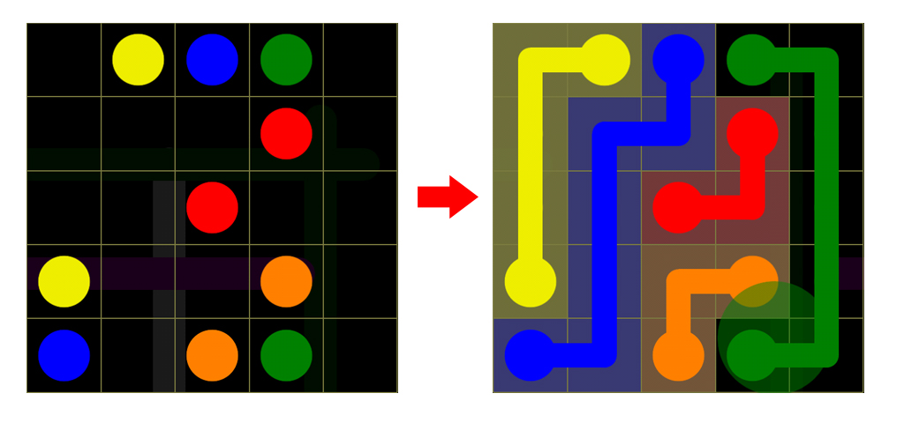
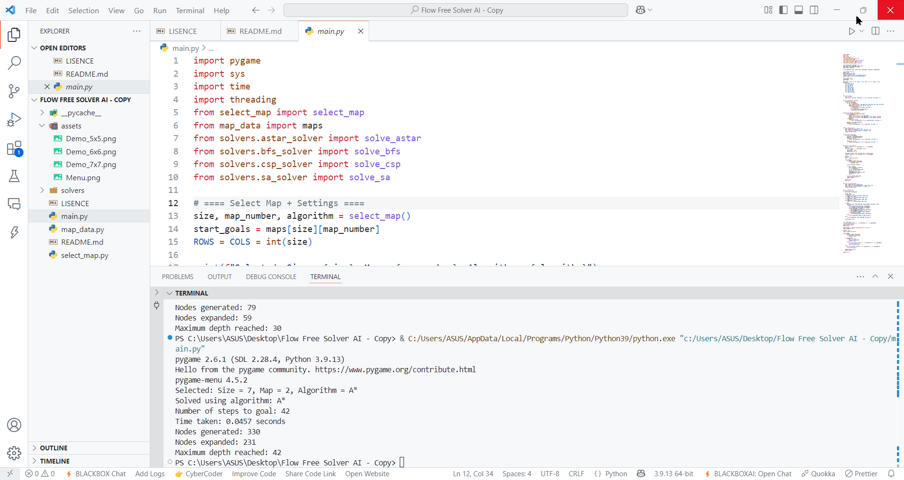
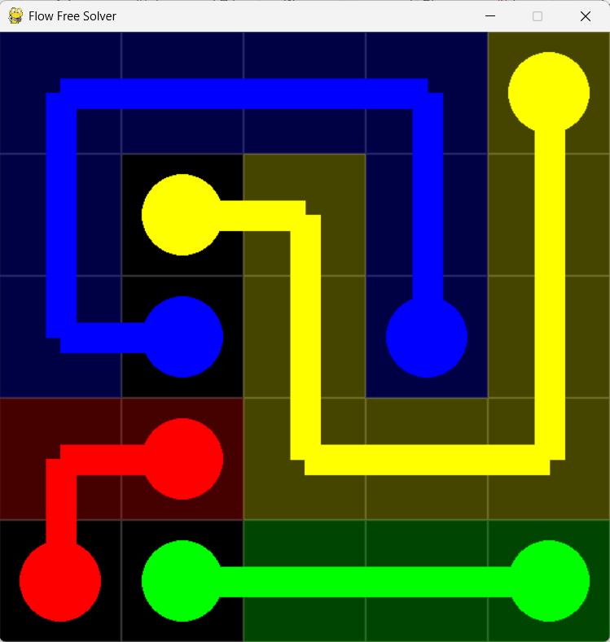

# **🌈 FLOW FREE SOLVER using AI Search Algorithms**



---

## **Mô tả về dự án**

**Flow Free Solver using AI Search Algorithms** là một dự án mô phỏng giải tự động trò chơi Flow Free – trò chơi nối các cặp điểm cùng màu trên lưới ô vuông sao cho các đường đi không được giao nhau và toàn bộ lưới được phủ đầy.

Dự án cung cấp một giao diện đồ họa thân thiện sử dụng thư viện PyGame, nơi người dùng có thể lựa chọn bản đồ đầu vào và thuật toán giải, đồng thời quan sát trực tiếp quá trình giải thông qua animation sinh động. Đây là một môi trường thử nghiệm lý tưởng để minh họa và kiểm chứng hoạt động của các thuật toán tìm kiếm trong lĩnh vực Trí tuệ nhân tạo (AI).

## **Mục tiêu**

**Dự án được thực hiện với các mục tiêu cụ thể như sau:**

- Tìm hiểu và triển khai các thuật toán tìm kiếm phổ biến trong AI, bao gồm cả thuật toán không có thông tin (BFS), có thông tin (A\*), thuật toán ràng buộc (CSP) và tối ưu hóa cục bộ (SA).

- Phát triển phần mềm có khả năng giải tự động các bản đồ Flow Free với kích thước từ 5x5 đến 7x7, phục vụ cho việc đánh giá và so sánh hiệu quả thuật toán.

- Tạo ra công cụ học tập tương tác, giúp sinh viên, nhà nghiên cứu hoặc giảng viên trực quan hóa hoạt động của các thuật toán tìm kiếm trong không gian ràng buộc.

- Thu thập và phân tích các chỉ số đánh giá hiệu suất, từ đó đưa ra nhận xét về ưu điểm, hạn chế, và phạm vi áp dụng của từng thuật toán trong môi trường bài toán cụ thể.

---

## **Nội dung**

**Dự án bao gồm các thành phần chính:**

- **Giao diện chọn bản đồ và thuật toán**: Cho phép người dùng chọn kích thước bản đồ (5x5, 6x6, 7x7), chọn thuật toán giải và bản đồ cụ thể trong danh sách.

- **Mô phỏng thuật toán tìm kiếm**: Hiển thị animation mô phỏng quá trình các thuật toán giải từng bước bài toán Flow Free, trực quan hóa đường đi của các luồng màu từ điểm đầu đến điểm đích.

- **Các thuật toán đã triển khai**:

  - **BFS** (Breadth-First Search): Tìm kiếm không có thông tin, duyệt theo chiều rộng.

  - **A\*** Search: Tìm kiếm có heuristic định hướng.

  - **CSP** (Constraint Satisfaction Problem): Duyệt kết hợp ràng buộc và kiểm tra forward-checking.

  - **SA** (Simulated Annealing): Phương pháp tối ưu hóa gần đúng trên không gian lời giải.

- **Thống kê kết quả**: Hiển thị số bước đi, thời gian chạy, số node được sinh ra và mở rộng, độ sâu tối đa... sau mỗi lần chạy thuật toán.

- **Đánh giá hiệu suất**: Thử nghiệm thuật toán trên các bản đồ tiêu biểu, ghi nhận hiệu quả và mức độ giải được của từng phương pháp.

---

## **Demo chương trình**



---

## **Yêu cầu**

Để chạy được chương trình Flow Free Solver using AI Search Algorithms, bạn cần đảm bảo các yêu cầu sau:

- **Python 3.x**: Cài đặt phiên bản Python 3 (khuyến nghị từ 3.8 trở lên).

- **Thư viện Pygame**: Dùng để hiển thị giao diện trò chơi.

Cài đặt bằng lệnh:

```
pip install pygame
```

- **Thư viện pygame-menu**: Hỗ trợ tạo menu lựa chọn bản đồ và thuật toán.

Cài đặt:

```
pip install pygame-menu
```

**Ngoài ra, chương trình sử dụng một số thư viện có sẵn như:**

- copy – sao chép cấu trúc dữ liệu

- math – các hàm toán học cơ bản

- random – sinh số ngẫu nhiên, trộn thứ tự

- time – đo thời gian thực thi

- threading – chạy thuật toán trong luồng riêng biệt

- heapq – hàng đợi ưu tiên trong A\*

- collections.deque – hàng đợi hai đầu cho BFS

---

## **Cách sử dụng**

**1. Tải mã nguồn:** Clone dự án từ GitHub về máy.

```
git clone https://github.com/House1904/Final_Project_AI.git
cd Final_Project_AI
```

**2. Cài đặt thư viện cần thiết**

**3. Chạy chương trình**

```
python main.py
```

**4. Tùy chọn thuật toán và bản đồ theo kích thước**

Sử dụng giao diện để:

- Chọn bản đồ giải và thuật toán tương ứng trên menu:


Nhập xong thì nhấn START để bắt đầu giải bản đồ bằng thuật toán mà bạn đã chọn.

- Quan sát quá trình giải và thông tin chi tiết ở console.



---

## **Giấy phép và Bản quyền**

Dự án này được cấp phép theo giấy phép [MIT License](LICENSE).

Bạn có thể sử dụng, sửa đổi và phân phối phần mềm này cho bất kỳ mục đích cá nhân hoặc thương mại nào, miễn là bạn giữ nguyên thông tin bản quyền và điều khoản giấy phép gốc.

---

## Các nguồn tham khảo

[Flow Free solver - by Matt Zucker](https://mzucker.github.io/2016/08/28/flow-solver.html)

[Flow Free Online Game - by Char Studio](https://www.bgames.com/game/flow-free-online/)

[Flow-Free-Solver - by jpvaishnav](https://github.com/jpvaishnav/Flow-Free-Solver)

[Flow Free Solver- by Deji Oyerinde(oko2107) and Kidus Mulu(km3533)](https://www.cs.columbia.edu/~sedwards/classes/2021/4995-fall/reports/ParallelFlow.pdf)

[flow-free-solver - by lohchness](https://github.com/lohchness/flow-free-solver)

## **Tác giả**

- Nhóm 04:
  | **Tên sinh viên** | **MSSV** |**Mức độ đóng góp**
  |:------------------------|:------------|:------------------
  |Lê Vũ Hào | 23133020 |100%
  |Lê An Bình | 23133007 |100%
  |Thái Đinh Trúc | 23133081 |100%

- Trường: Đai học Sư phạm Kỹ thuật Thành phố Hồ Chí Minh

- Môn học: Trí tuệ nhân tạo (Artificial Intelligence)
